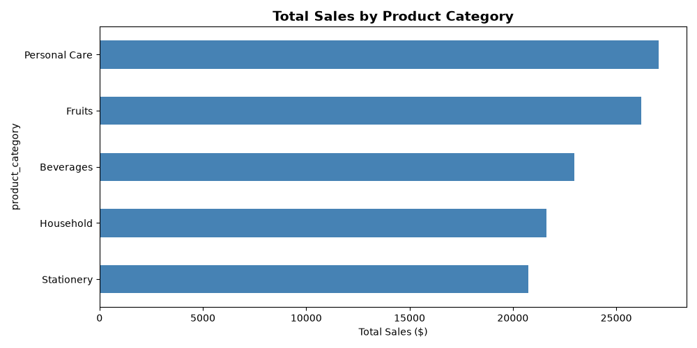
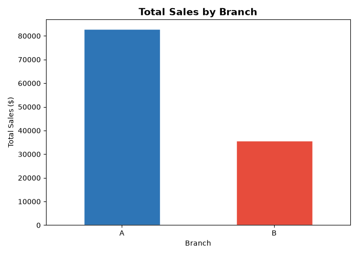
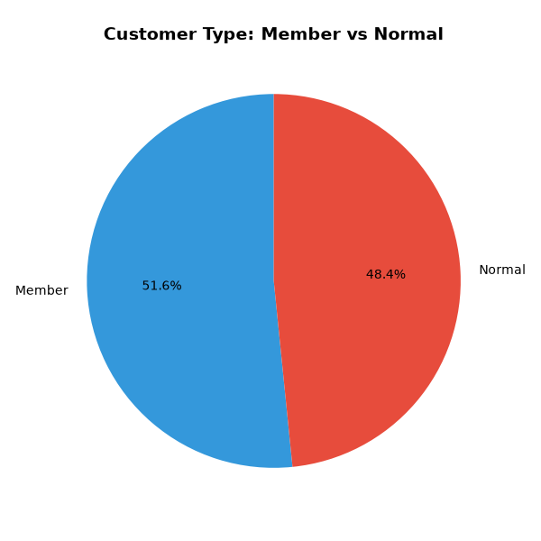
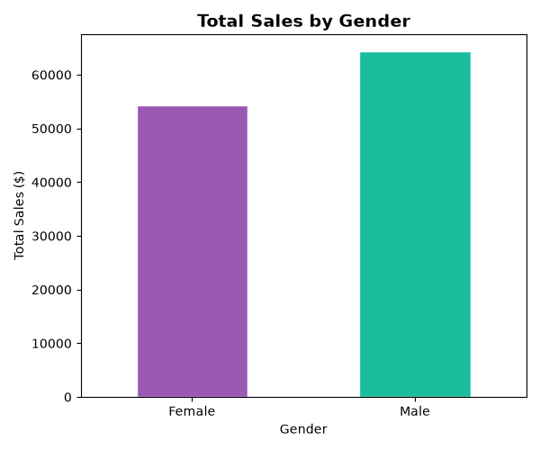
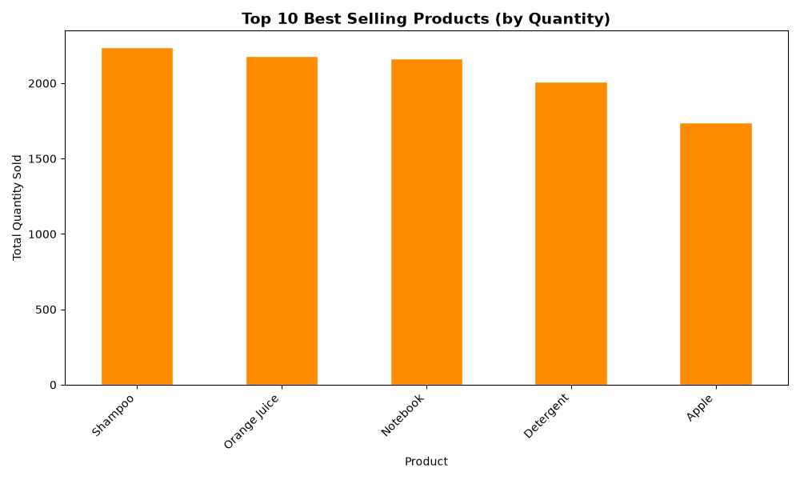
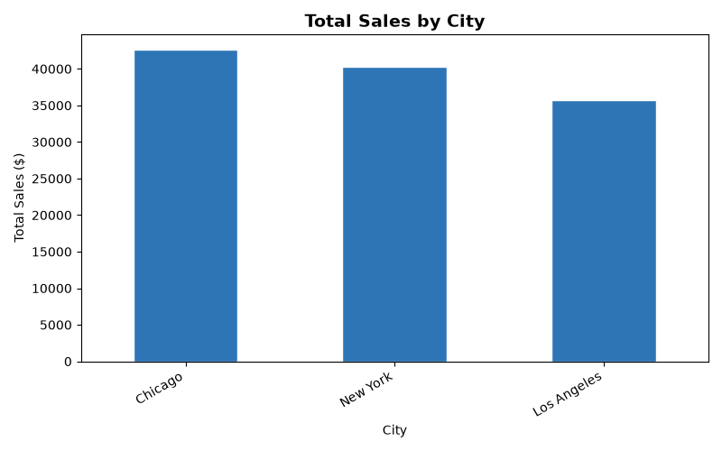

# 📊 Supermarket Sales Data Analysis

Analyzed 1,000 real sales transactions using Python to extract 
business insights and visualize trends.

## Key Findings
- 💰 Total Revenue: $118,583.90
- 🏆 Best Performing Branch: Branch A
- 🏙️ Best City by Sales: Chicago
- 🛍️ Top Product Category: Personal Care
- 📦 Best Selling Product: Shampoo
- 👥 Dominant Customer Type: Members
- 🧑 Dominant Gender: Male
- 🛒 Total Items Sold: 10,337
- 💵 Average Transaction Value: $118.58

## Charts

### Total Sales by Product Category

### Total Sales by Branch

### Customer Type Distribution

### Sales by Gender

### Top 10 Best Selling Products

### Total Sales by City

## Tools Used
- Python
- Pandas (data manipulation)
- Matplotlib (data visualization)

## Dataset
1,000 sales transactions with 12 columns including branch, 
city, customer type, gender, product, price and quantity.
